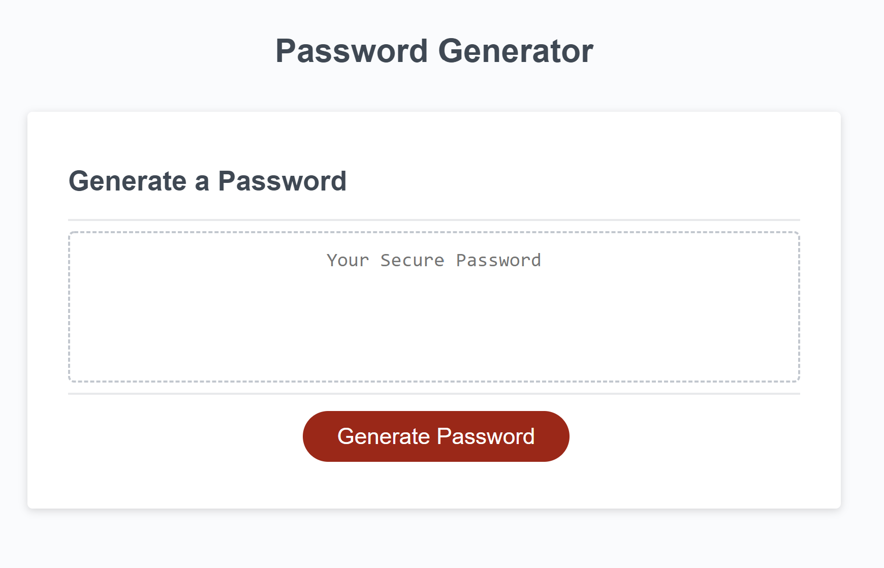

# Password Generator
This application creates a randomly generated password for the user. 

The application will begin by clicking the 'Generate Password' button, and will ask the user to input the amount of characters that they would like their generated password to have. The randomly generated password must be between 8 and 128. From there, a variety of questions will be asked to the user as to what criterias they would like ther password to consist of. These criterias include:
```
1. Lower case letters
2. Upper case letters
3. Numbers
4. Special characters
```

Depending on the length of password that the user chose and the criterias selected, a password will be generated inside the box.

An image of the password generator:



The password generator can be accessed here:

[https://axe714.github.io/PasswordGenerator]